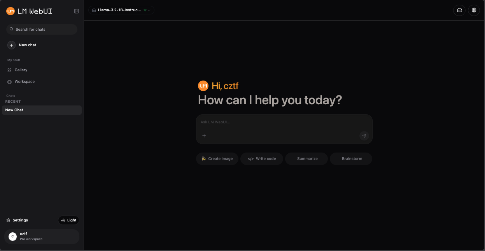

# LM-WebuUI

  

  <!-- badges here -->

---

> ⚠️ **Work in Progress (WIP)**
> lm-webui is under active development. Features, APIs, and architecture may change as the project evolves. Contributions, feedback, and early testing are welcome, but expect breaking changes.

**lm-webui** is a multimodal LLM interface and orchestration platform designed for **privacy-first, fully offline AI workflows**.

It unifies local and API-based models, RAG pipelines, and multimodal inputs under a single control plane—while keeping data ownership, performance, and deployment flexibility firmly in the user’s hands.

Built for developers, system integrators, and organizations that require **local inference, reproducibility, and infrastructure-level control**, lm-webui bridges the gap between experimental LLM tooling and production-ready AI systems.

---

## Privacy, Security & Offline-First Design

lm-webui is designed around environments where **data control and execution locality are non-negotiable**.

* 🔒 **Privacy-first by design** — prompts, documents, embeddings, and outputs remain local by default
* 📡 **Fully offline capable** — operate without internet access using local models and on-device inference
* 🏠 **Self-hosted architecture** — deploy on personal machines, servers, private clouds, or air‑gapped networks
* 🚫 **No mandatory telemetry** — no external tracking or data collection required
* 🧾 **Source-aware retrieval** — RAG responses can expose document origin and metadata for auditability
* ⚙️ **Controlled execution** — model runtimes and tools are explicitly configured and isolated

This makes lm-webui suitable for internal tools, regulated environments, proprietary data workflows, and edge deployments.

---

## Core Features

| Category                   | Capabilities                                                                                 |
| -------------------------- | -------------------------------------------------------------------------------------------- |
| **Multimodal Interface**   | Text, document, and multimodal input handling within a unified UI                            |
| **RAG Engine**             | Configurable retrieval pipelines with local vector stores and source attribution             |
| **Model‑Agnostic Runtime** | Run local models or API-based LLMs through a consistent orchestration layer                  |
| **Full Local Capability**  | End‑to‑end local execution: models, embeddings, storage, and inference                       |
| **GGUF Loader Engine**   | Built‑in model deployment engine for GGUF-based local models, including quantized variants   |
| **Hardware Acceleration**  | Automatic hardware detection and optimized execution on CPU, GPU, and supported accelerators |
| **Backend Flexibility**    | Compatible with multiple inference backends (e.g., llama.cpp‑style runtimes)                 |
| **Workflow Orchestration** | Chain prompts, tools, retrieval, and models into reproducible workflows                      |
| **Self‑Hosted Ready**      | Designed for on‑prem, private cloud, and isolated network deployments                        |

---

## Roadmap & Known Limitations

This project is evolving toward a stable, production-grade release. The following outlines current limitations and planned improvements.

### Known Limitations

* Some model backends and multimodal pipelines are still experimental
* Some chat dan multimodal conversation are still buggy and under improvement
* Hardware acceleration behavior may vary across GPU vendors and driver versions
* RAG source attribution and metadata handling are functional but not yet fully standardized
* Limited validation and guardrails for misconfigured local models or incompatible GGUF variants
* Documentation and deployment examples are incomplete and actively expanding

### Roadmap (High-Level)

**Near-term**

* Stabilize core orchestration APIs and configuration schema
* Improve GGUF deployment automation and quantization presets
* Expand hardware detection and backend fallback logic

**Mid-term**

* Add stronger RAG governance (source versioning, metadata filters, audit-friendly outputs)
* Introduce model bundle validation and optional signature checks
* Improve workflow reproducibility and export/import support

**Long-term**

* Advanced scheduling for multi-GPU and multi-model workloads
* Adapter / LoRA management for task-specific fine-tuning
* Enterprise-oriented features (role-based access, audit logs, policy controls)

---

lm-webui focuses on **operational clarity over abstraction**—providing the building blocks required to deploy, govern, and scale local AI systems without surrendering control to opaque cloud platforms.
