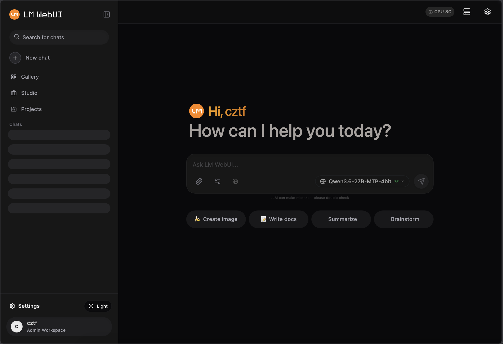

# LM WebUI 🛡️

**LM-WebUI** is a self-hosted private multimodal AI workspace with runtime manager. It combines multimodal chat, and image generation with multi-model (local and cloud models) compatible, file context, and provider orchestration in one interface — built for privacy-first and sovereign AI systems.

<p align="center">
  
</p>

<p align="center">
  <a href="https://github.com/lm-webui/lm-webui/actions">
    
  </a>
  <a href="https://github.com/lm-webui/lm-webui/releases">
    
  </a>
  <a href="LICENSE">
    
  </a>
  <a href="https://lmwebui.com">
    
  </a>
</p>

<p align="center">
  <b>Run AI on your control</b>
</p>

---

Built open-source for the community, developers, system integrators, and organizations that require **local inference, reproducibility, and infrastructure-level control**, lm-webui bridges the power of modern cloud LLM features with the integrity of local data ownership.

Run fully offline, integrate with cloud APIs when needed, and deploy across environments without sacrificing performance, privacy, or sovereignty.

---

## 🚀 Quick Start

### Docker (Recommended)

```bash
git clone https://github.com/lm-webui/lm-webui.git
cd lm-webui
docker compose up --build
```

Open `http://localhost:7070`.

### Development

```bash
# 1. Install root dependencies
npm install

# 2. Backend setup
cd backend
python -m venv .venv && source .venv/bin/activate
pip install -r requirements.txt

# 3. Start both backend and frontend
cd ..
npm run dev
```

The web client runs on the configured Vite port and proxies API requests to the FastAPI backend on port `8000`.

---

## ⚡ Core Features

| Feature | Capabilities |
|---|---|
| **Authentication** | Secure JWT-based authentication with httpOnly cookies, refresh tokens, session persistence, and role-based permissions. Remember-me toggle for session control. |
| **Chat** | Multi-provider chat through OpenAI, Gemini, Anthropic, DeepSeek, xAI, vLLM, Ollama, GGUF (llama.cpp), and MLX. Streaming responses, code rendering, Mermaid diagrams, conversation management, and search. |
| **Image Generation** | Dedicated Image Studio with prompt, size, quality, and seed controls. Gallery for browsing and reuse. Supports OpenAI, Google Gemini, and local ComfyUI runtimes. |
| **Projects** | Group related conversations with reusable custom system prompts. Ideal for recurring workflows like code review, research, or team-specific assistant configurations. |
| **File Context** | Upload files for conversation context. Image and document processing, upload status, file references with conversations, and citation display in chat. |
| **GGUF Runtime** | Built-in GGUF model lifecycle — download from HuggingFace, upload, validate, and serve models locally. Hardware-compatibility checking and local model registry. |
| **MLX Runtime** | Model discovery, download, and management for Apple Silicon. Seamless integration with the chat interface. |
| **Hardware Detection** | Automatic detection of CPU, CUDA, ROCm, and Apple Metal with dynamic memory and layer optimization for efficient local execution. |
| **Runtime Manager** | Detect, register, and test local runtimes including Ollama, GGUF (llama.cpp), MLX, vLLM, and ComfyUI through the admin interface. |
| **Artifacts** | Persistent structured document storage with versioning, project and conversation association, and soft-delete support. |
| **Usage Analytics** | Token and request tracking per provider and model. Admin dashboard with usage summaries, per-user breakdowns, and CSV export. |
| **Self-Hosted Ready** | Single Docker container, zero external telemetry, offline-capable. Mount your models, data, and media as volumes. |

---

## 🤗 GGUF Runtime Highlights

- **Model Management**: Upload and download GGUF models with progress tracking
- **HuggingFace Integration**: Direct download from HuggingFace repositories
- **Hardware Compatibility**: Automatic model validation for your system
- **Local Registry**: Manage and organize local GGUF models
- **Seamless Integration**: Use GGUF models directly in chat conversations

---

## 📖 Documentation

For detailed documentation, see the [`docs/`](./docs/) directory:

- **[Getting Started](./docs/getting-started.md)** — Complete setup guide
- **[Features](./docs/features.md)** — Detailed feature documentation
- **[Architecture](./docs/architecture.md)** — Backend, frontend, provider, and runtime design
- **[Deployment](./docs/DEPLOYMENT.md)** — Production deployment guides
- **[CLI](./docs/cli.md)** — Host CLI reference
- **[Contributing](./CONTRIBUTING.md)** — How to contribute to the project
- **[Security](./SECURITY.md)** — Security政策和 practices

---

## </> Architecture Overview

LM-WebUI is a React + FastAPI application with a modular monolith backend and a feature-based frontend.

```
lm-webui/
├── backend/               # FastAPI application
│   ├── app/
│   │   ├── routes/        # REST + WebSocket API endpoints
│   │   ├── providers/     # AI provider implementations (remote + local)
│   │   ├── orchestrator/  # Chat flow controller and streaming
│   │   ├── services/      # Models, images, files, audit, usage tracking
│   │   ├── chat/          # Session and message persistence
│   │   ├── database/      # SQLite schema, migrations, connection pool
│   │   ├── hardware/      # GPU/CPU detection and quantization
│   │   ├── memory/        # Context assembly and conversation summarization
│   │   ├── runtime/       # Runtime detection and metadata
│   │   └── security/      # JWT authentication, encryption, RBAC
│   └── tests/             # Backend tests
├── web/                   # React 19 + TypeScript frontend
│   ├── src/
│   │   ├── components/    # UI components (shadcn/ui + custom)
│   │   ├── features/      # Domain logic (chat, images, models, sessions)
│   │   ├── store/         # Zustand state management
│   │   ├── services/      # WebSocket client and API services
│   │   └── utils/         # API client, providers, helpers
│   └── dist/              # Built frontend (served by backend in production)
└── docs/                  # Canonical documentation
```

The backend is a modular monolith. Providers implement a shared interface, the orchestrator coordinates chat execution, and the frontend consumes REST and WebSocket APIs.

### Data Flow

```
Chat:     User → WebSocket/REST → Orchestrator → Provider → LLM → Stream → UI
Images:   Studio → POST /api/images/generate → Handler → API/ComfyUI → Save → Gallery
Models:   Model Selector → GET /api/models/* → Model Registry → Provider.list_models()
```

---

## 🔧 Development Commands

```bash
npm run dev          # Start both backend and web client
npm run build        # Build the web client (output: web/dist/)
npm run typecheck    # TypeScript checks
npm run test         # Frontend tests
npm run lint         # Frontend linting
npm run format       # Format frontend code
```

---

## 🚢 Deployment

The recommended deployment is one LM-WebUI Docker container with runtimes installed outside the application container.

```bash
docker compose up -d --build
```

Docker packages the web application, authentication, RBAC, projects, artifacts, and usage analytics. Host runtimes provide hardware-specific inference.

Use the Runtime Manager as an administrator to register and test Ollama or another OpenAI-compatible local endpoint. Install host runtimes with the separate `lm-webui-host` CLI — the application container does not install drivers or modify the host operating system.

### Persistence

| Data | Location |
|---|---|
| SQLite / application data | Docker volume → `/backend/data` |
| Generated media / uploads | Docker volume → `/backend/media` |
| Local models | `./backend/models` → `/backend/models` |
| Secrets | `./backend/.secrets` → `/backend/.secrets` |

See [Host CLI](./docs/cli.md) and [Deployment](./docs/DEPLOYMENT.md) for setup, runtime endpoints, and troubleshooting.

---

## 🤝 Contributing

We welcome contributions! Please see our [Contributing Guide](./CONTRIBUTING.md) for details.

1. Fork the repository
2. Create a feature branch
3. Make your changes
4. Add tests
5. Submit a pull request

---

## 📄 License

This project is licensed under the MIT License — see the [LICENSE](LICENSE) file for details.

---

## 🔗 Links

- **Website**: [lmwebui.com](https://lmwebui.com)
- **GitHub**: [github.com/lm-webui/lm-webui](https://github.com/lm-webui/lm-webui)
- **Issues**: [GitHub Issues](https://github.com/lm-webui/lm-webui/issues)
- **Discussions**: [GitHub Discussions](https://github.com/lm-webui/lm-webui/discussions)

---

<p align="center">
  <b>Let's shape the future of local AI together 🤜🤛</b>
</p>
