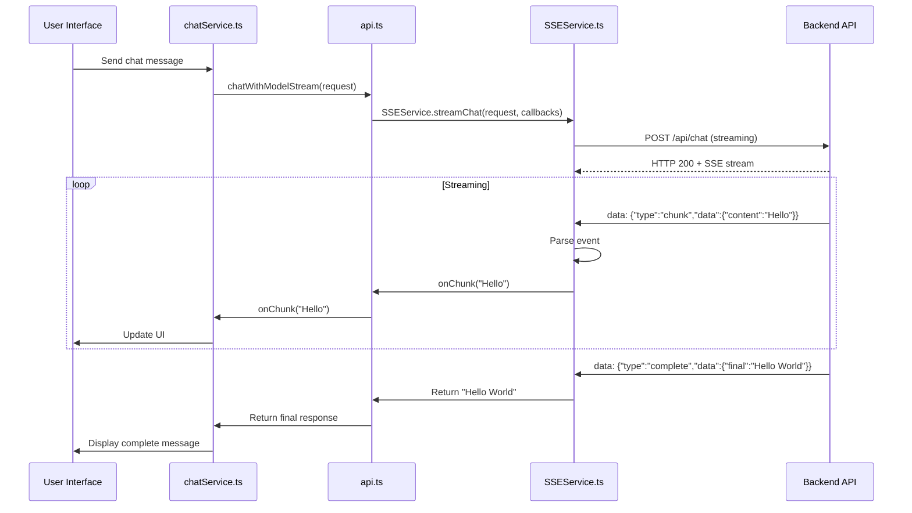
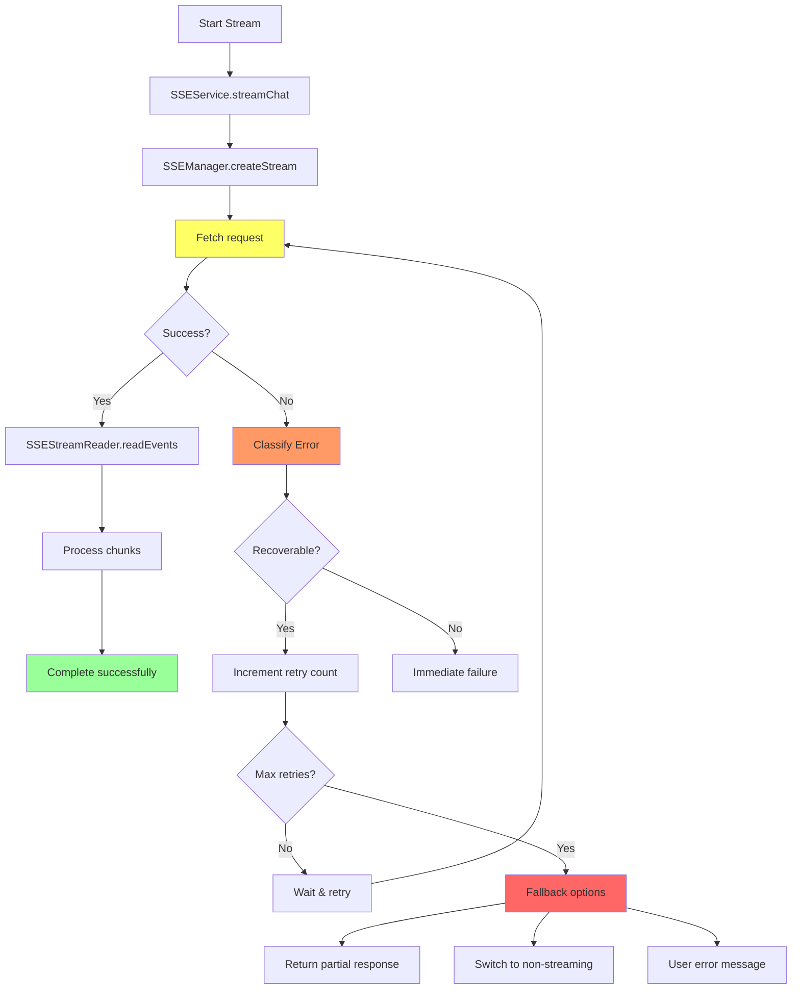

# Simplified Streaming Architecture (Single File Approach)

## Architecture Overview

```mermaid
graph TD
    A[UI Components] --> B[chatService.ts]
    B --> C[api.ts]
    C --> D{Streaming Request?}
    D -->|Yes| E[SSEService.ts<br/>Single File - 400-500 lines]
    D -->|No| F[Regular REST API]

    subgraph "SSEService.ts (Consolidated)"
        E --> G[SSEStreamReader Class]
        G --> H[Parse SSE Events]
        H --> I[Format Detection<br/>Standard + Legacy]
        G --> J[Error Recovery]
        J --> K[Automatic Retry]
        J --> L[Reconnection Logic]
        G --> M[Heartbeat Monitoring]

        E --> N[SSEManager Class]
        N --> O[Connection Pool]
        N --> P[Active Stream Tracking]
        N --> Q[Cancellation Support]

        E --> R[SSEService Facade]
        R --> S[streamChat() Method]
        R --> T[createStream() Method]
        R --> U[Utility Functions]
    end

    E --> V[Return Streamed Response]
    F --> W[Return JSON Response]

    style E fill:#9f9
    style subgraph fill:#eef
```

## File Structure Comparison

### Before (Current)

```
frontend/src/utils/api.ts (933 lines)
├── Regular API functions (700 lines)
└── Manual SSE parsing (80+ lines, mixed in)
    ├── Buffer management
    ├── Format detection
    ├── Error handling (basic)
    └── No reconnection
```

### After (Proposed)

```
frontend/src/utils/api.ts (~850 lines)
├── Regular API functions (700 lines)
└── Streaming calls to SSEService (10 lines)

frontend/src/services/SSEService.ts (400-500 lines)
├── Types & Interfaces (50 lines)
├── SSEStreamReader Class (200 lines)
├── SSEManager Class (100 lines)
├── SSEService Facade (100 lines)
└── Utility Functions (50 lines)
```

## Data Flow



## Error Recovery Flow



## Implementation Timeline

```mermaid
gantt
    title SSEService.ts Implementation Timeline
    dateFormat  D
    axisFormat  Day %d

    section Phase 1: Foundation
    Create SSEService.ts file     :d1, 1d
    Implement core classes        :d1, 2d

    section Phase 2: Integration
    Update api.ts to use SSEService :d3, 1d
    Remove old parsing code        :d3, 1d

    section Phase 3: Testing
    Unit tests                    :d4, 1d
    Integration tests             :d4, 1d
    Performance tests             :d5, 1d

    section Phase 4: Deployment
    Canary deployment (10%)       :d6, 1d
    Monitor & fix issues          :d6, 2d
    Full rollout (100%)           :d8, 1d
```

## Key Benefits of Single File Approach

### 1. **Simplicity**

- **One file** to maintain instead of 4-5
- **No cross-file dependencies** to manage
- **Easier onboarding** for new developers

### 2. **Maintainability**

- **All streaming logic in one place**
- **Easy to see the whole picture**
- **Simpler refactoring and updates**

### 3. **Performance**

- **No import overhead** between files
- **Better tree shaking** potential
- **Smaller bundle size** than multiple files

### 4. **Implementation Speed**

- **Faster to create** (no file structure setup)
- **Easier to test** (single file to import)
- **Quicker debugging** (everything in one place)

## Migration Impact

### Code Changes Required:

1. **Create**: `frontend/src/services/SSEService.ts` (new file)
2. **Update**: `frontend/src/utils/api.ts` (replace 80 lines with 10 lines)
3. **Remove**: Manual SSE parsing code from `_chatWithModel`
4. **Update**: Comments about temporary workaround

### No Changes Required:

1. **API signatures**: `chatWithModelStream()` remains the same
2. **Callers**: `chatService.ts` and other components work unchanged
3. **Backend interface**: Same HTTP endpoints, same SSE format (with better handling)

## Risk Assessment

| Risk                        | Probability | Impact | Mitigation                             |
| --------------------------- | ----------- | ------ | -------------------------------------- |
| Breaking existing streaming | Low         | High   | Feature flag, canary deployment        |
| Performance regression      | Medium      | Medium | Performance testing before deployment  |
| Bundle size increase        | Low         | Low    | Single file is efficient, monitor size |
| Backend compatibility       | Low         | Medium | Format detection handles both old/new  |

## Success Metrics

### Technical Metrics:

- **Error rate**: < 1% streaming failures (currently unknown)
- **Latency**: First chunk < 100ms, complete response < 5s
- **Bundle size**: < 20KB increase (acceptable for production)
- **Memory**: No leaks in 24-hour streaming tests

### User Experience Metrics:

- **Success rate**: > 99% streaming completion
- **Recovery rate**: > 90% automatic reconnection success
- **User satisfaction**: No increase in support tickets
- **Performance**: No noticeable degradation

## Conclusion

The single-file `SSEService.ts` approach provides the best balance of:

1. **Production readiness** - Proper error handling, reconnection, monitoring
2. **Simplicity** - One file instead of complex multi-file architecture
3. **Backward compatibility** - Existing code works unchanged
4. **Maintainability** - Clean separation from `api.ts` business logic
5. **Implementation speed** - Can be completed in 4-5 days

This directly addresses the "temporary workaround" comment by providing a production-ready streaming solution while keeping the architecture simple and maintainable.
