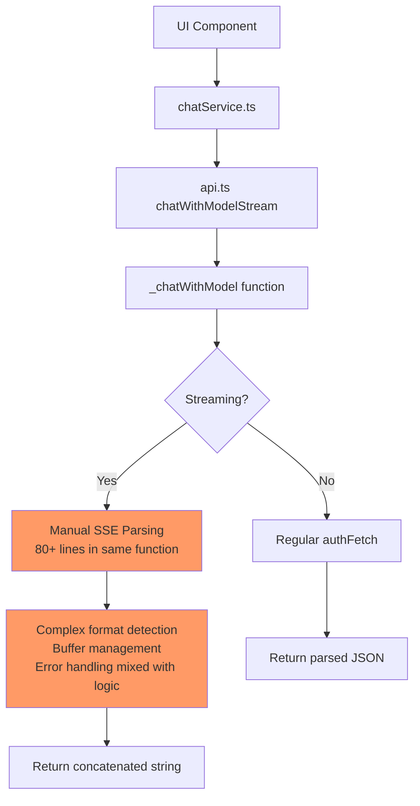
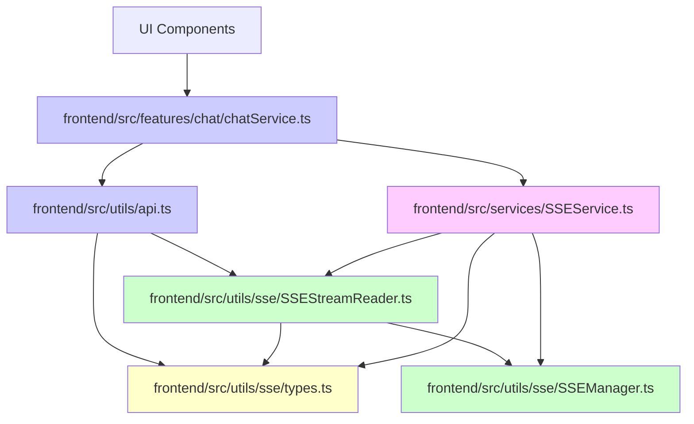
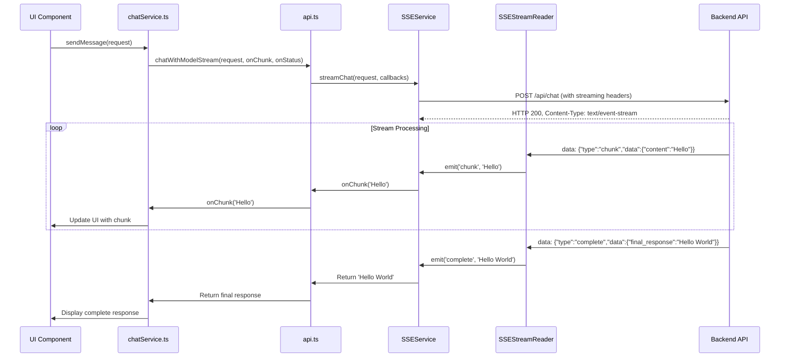
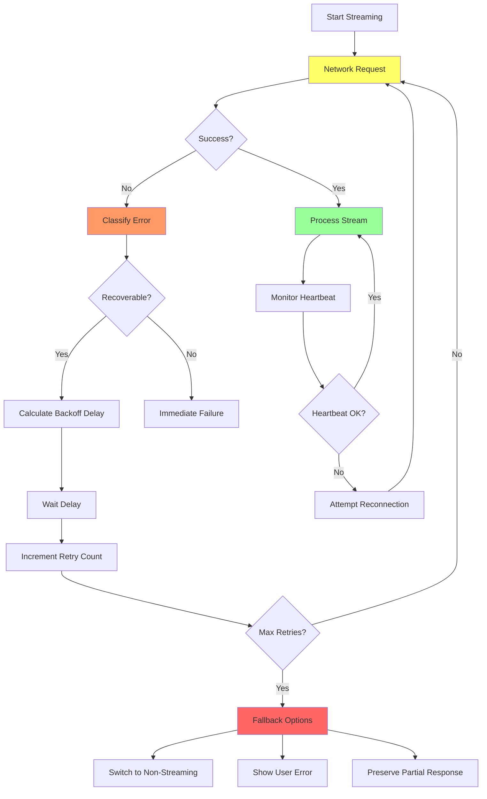
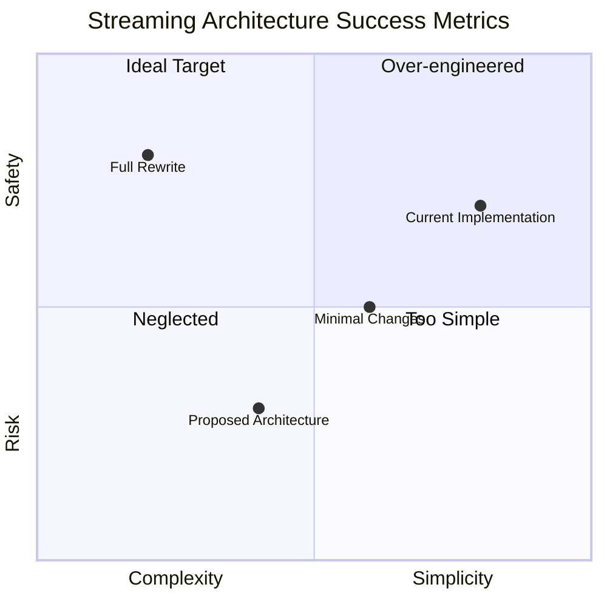
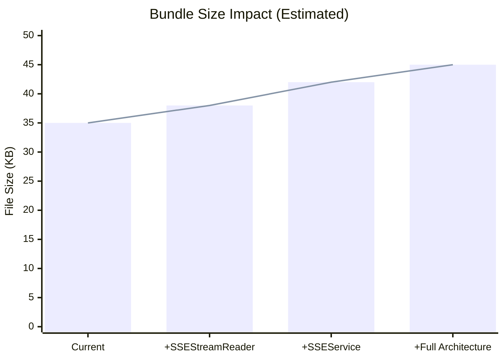

# Streaming Architecture Diagram

## Current Architecture (Problematic)



**Issues**: Streaming logic mixed with business logic, no separation, poor error handling.

## Proposed Architecture (Production Ready)

```mermaid
graph TD
    A[UI Component] --> B[chatService.ts]
    B --> C[api.ts chatWithModelStream]
    C --> D[_chatWithModel function]
    D --> E{Streaming?}
    E -->|Yes| F[SSEService.streamChat]
    E -->|No| G[Regular authFetch]

    subgraph "SSE Layer (Separate Files)"
        F --> H[SSEStreamReader]
        H --> I[Format Detection]
        I --> J[Legacy Format Parser]
        I --> K[New Format Parser]
        H --> L[Error Recovery]
        L --> M[Automatic Retry]
        L --> N[Reconnection Logic]
        H --> O[Event Emission]
        O --> P[Chunk Events]
        O --> Q[Status Events]
        O --> R[Error Events]
    end

    subgraph "Connection Management"
        H --> S[SSEManager]
        S --> T[Heartbeat Monitoring]
        S --> U[Timeout Handling]
        S --> V[Connection Pool]
    end

    F --> W[Return concatenated string]
    G --> X[Return parsed JSON]

    style F fill:#9f9
    style H fill:#9f9
    style subgraph fill:#eef
```

**Benefits**: Clean separation, reusable components, production-grade error handling.

## File Dependency Graph



## Data Flow for Streaming Chat



## Error Recovery Flow



## Migration Path from Current to Proposed

```mermaid
timeline
    title Streaming Architecture Migration
    section Phase 1: Foundation
        Week 1 : Create SSEStreamReader<br/>with format detection
        Week 1 : Unit tests for parsing
    section Phase 2: Integration
        Week 2 : Update _chatWithModel<br/>to use SSEStreamReader
        Week 2 : Integration tests<br/>with current backend
    section Phase 3: Enhancement
        Week 3 : Add error handling<br/>and reconnection
        Week 3 : Create SSEService facade
    section Phase 4: Refinement
        Week 4 : Performance optimization
        Week 4 : Documentation updates
    section Phase 5: Deployment
        Week 5 : Canary testing<br/>(10% users)
        Week 5 : Full rollout<br/>(100% users)
```

## Key Decision Points

### 1. File Splitting Strategy

```
Option 1: Minimal Split
api.ts (keep streaming)
└── sseUtils.ts (helper functions)

Option 2: Moderate Split ✓ Recommended
api.ts (streaming calls)
├── SSEStreamReader.ts (core parser)
└── streamingUtils.ts (helpers)

Option 3: Full Split
api.ts (no streaming)
├── SSEService.ts (facade)
├── SSEStreamReader.ts (parser)
├── SSEManager.ts (connections)
└── types.ts (interfaces)
```

### 2. Backend Coordination Timeline

```
Immediate: Frontend handles both formats
Short-term: Backend updates to standard SSE
Long-term: Frontend removes legacy support
```

### 3. Error Handling Strategy

```
Level 1: Basic retry (network errors)
Level 2: Format fallback (malformed SSE)
Level 3: Non-streaming fallback (max retries)
Level 4: User recovery options
```

## Success Metrics Visualization



**Interpretation**: The proposed architecture moves from high complexity/risk (current) to moderate complexity with much lower risk (ideal target).

## Bundle Size Impact



**Estimated increase**: 10-15KB (28% increase) for full production architecture, but with significantly improved reliability and maintainability.

## Conclusion

The diagrams show that splitting streaming logic into separate files creates a cleaner, more maintainable architecture that addresses the "temporary workaround" issue while maintaining backward compatibility. The proposed structure balances separation of concerns with practical implementation constraints.
